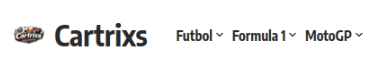
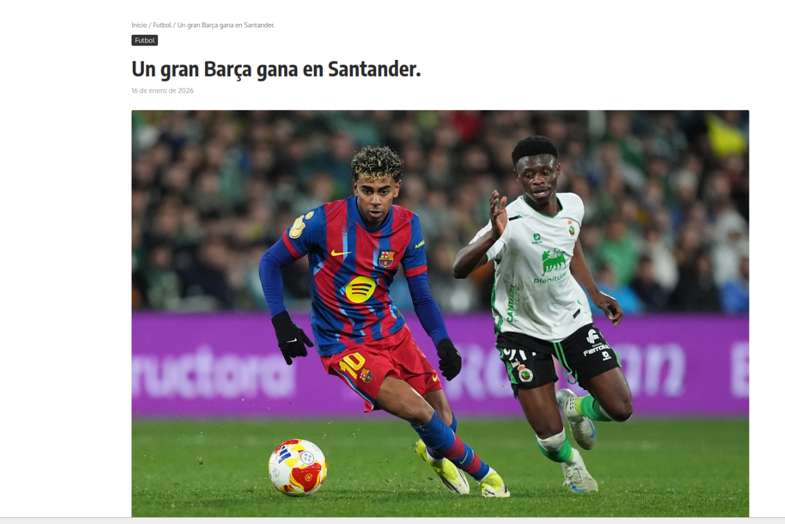
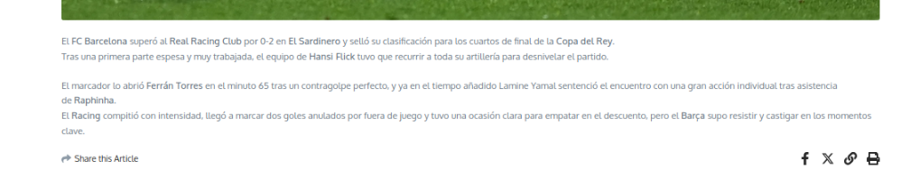
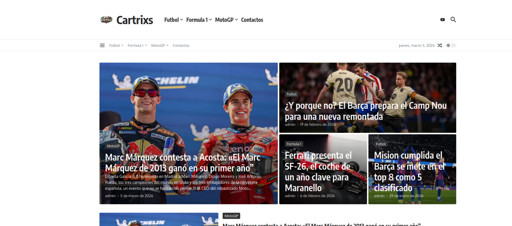

# Practica-Tema-3-instalacion-y-configuracion-de-WordPress

## Descripción del proyecto

El proyecto consiste en la creación de un portal web de noticias deportivas desarrollado con WordPress, utilizando el tema Cartrixs.
La web está enfocada en publicar noticias y contenido sobre tres deportes muy conocidos:

- Futbol
- Formula 1
- MotoGP

El objetivo del portal es ofrecer a los usuarios información actualizada sobre partidos, resultados y novedades relacionadas con equipos de futbol, de Formula 1 y MotoGP

---

## Instalación y configuración

**Instalación del tema**

Una vez instalado WordPress se instaló el tema Cartrixs.

**Pasos realizados:**
- Ir a Apariencia → Temas.
- Seleccionar Añadir nuevo tema.
- Buscar el tema Cartrixs o subir el archivo del tema.
- Hacer clic en Instalar.
- Activar el tema.

**Después se personalizó desde Apariencia → Personalizar, donde se modificaron:**

- colores del sitio
- logotipo
- menú principal
- estructura de la página principal.

---

## Categorías principales ##

**Se crearon tres categorías de noticias:**

- Futbol
- MotoGP
- Formula 1

Cada noticia publicada pertenece a una de estas categorías para facilitar la navegación.
 
 

---

## Cada entrada incluye: ##

- título de la noticia
- contenido o texto de la noticia
- imagen destacada
- categoría correspondiente
- fecha de publicación.

---

## Menú de navegación ##

Se creó un menú principal para facilitar el acceso a las diferentes secciones del portal.

El menú incluye:

- Futbol
- MotoGP
- Formula 1
- Contacto

Esto permite que los usuarios encuentren rápidamente la información que buscan.

